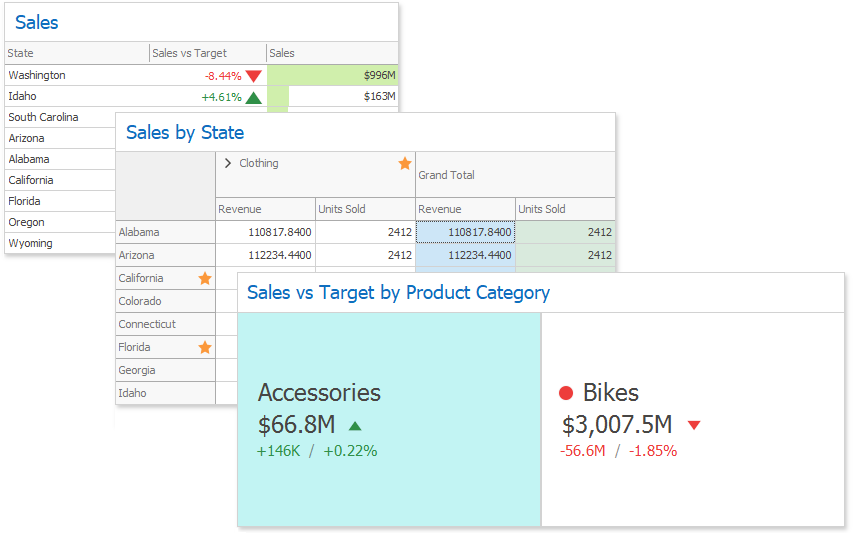
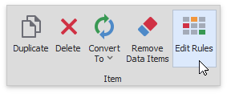
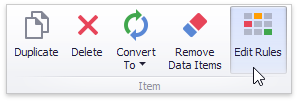

# Conditional Formatting
The Dashboard Designer control supports conditional formatting. You can apply a custom style to data elements that satisfy a certain condition. Supported elements include cells in [Grid](../designing-dashboard-items/grid.md) or [Pivot Grid](../designing-dashboard-items/pivot.md), and cards in the [Card item](../designing-dashboard-items/cards.md).

Comparison rules used in conditional formatting can be divided into the following groups:
* [Value](conditional-formatting/value.md) - Allows you to compare static values (such as Greater Than, Less Than, Between, etc.).
* [Top-Bottom](conditional-formatting/top-bottom.md) - Highlights a specific number of top/bottom values (Top N, Bottom N).
* [Average](conditional-formatting/average.md) - Highlights values above or below the average value.
* [A Date Occurring](conditional-formatting/a-date-occurring.md) - Allows you to highlight date-time values that fall into a specified interval.
* [Expression](conditional-formatting/expression.md) - Allows you to use complex conditions to apply formatting. You can also pass dashboard parameters to expressions.
* [Icon Ranges](conditional-formatting/icon-ranges.md) - Allows you to apply formatting by displaying specific icons for different ranges of values. You can select a predefined set of icons or use a specific icon for each range.
* [Color Ranges](conditional-formatting/color-ranges.md) - Allows you to apply formatting using specific colors for different ranges of values. You can select a predefined set of colors or use custom appearance settings to highlight values within specified ranges.
* [Gradient Ranges](conditional-formatting/gradient-ranges.md) - Allows you to apply formatting using gradient color scales.
* [Bar](conditional-formatting/bar.md) - Allows you to visualize numeric values using bars. You can also color bars corresponding to positive and negative values using different colors.
* [Bar Color Ranges](conditional-formatting/bar-color-ranges.md) - Allows you to visualize numeric values using bars whose colors are contained in the specified color set.
* [Bar Gradient Ranges](conditional-formatting/bar-gradient-ranges.md) - Allows you to visualize numeric values using bars whose colors are contained in the specified color gradient.

Format conditions that can be applied to different data item types are as follows:
* numeric
	* [Value](conditional-formatting/value.md)
	* [Top-Bottom](conditional-formatting/top-bottom.md)
	* [Average](conditional-formatting/average.md)
	* [Expression](conditional-formatting/expression.md)
	* [Icon Ranges](conditional-formatting/icon-ranges.md)
	* [Color Ranges](conditional-formatting/color-ranges.md)
	* [Gradient Ranges](conditional-formatting/gradient-ranges.md)
	* [Bar](conditional-formatting/bar.md) 1 
	* [Bar Color Ranges](conditional-formatting/bar-color-ranges.md) 1 
	* [Bar Gradient Ranges](conditional-formatting/bar-gradient-ranges.md) 1 
* string 
	* [Value](conditional-formatting/value.md) with the condition type set to _Equal To_, _Not Equal To_ or _Text that Contains_
	* [Expression](conditional-formatting/expression.md)
* date-time
	* [Value](conditional-formatting/value.md)
	* [A Date Occurring](conditional-formatting/value.md) (for dimensions with a continuous date-time group interval)
	* [Expression](conditional-formatting/expression.md)
	* [Icon Ranges](conditional-formatting/icon-ranges.md)
	* [Color Ranges](conditional-formatting/color-ranges.md)
	* [Gradient Ranges](conditional-formatting/gradient-ranges.md)
	* [Bar](conditional-formatting/bar.md) 1 
	* [Bar Color Ranges](conditional-formatting/bar-color-ranges.md) 1 
	* [Bar Gradient Ranges](conditional-formatting/bar-gradient-ranges.md) 1 

	1  The Card dashboard item does not support these rules.

## Create a Format Rule

You can create format rules in the following ways:

* Click the **Edit Rules** button on the **Home** ribbon tab. 

  

	The invoked dialog contains the **calculated by** combo box where you can select the item whose values are used to calculate the format rule. You can calculate a format rule using [measures or dimensions](../binding-dashboard-items-to-data/binding-dashboard-items-to-data.md). For the Card dashboard item, format rules also can be calculated with [delta](../designing-dashboard-items/cards/delta.md) values. 
	Specify the delta type if you calculate a condition by delta in the **using** combo box. Click the **Add** button, select the format rule from the pop-up menu, and specify the rule's condition:

	

* Click the measure/dimension menu button in the Data Item's pane and select **Add Format Rule** to invoke the same pop-up menu. For the Card, this menu is invoked when you click the series dimension/[hidden measure](../binding-dashboard-items-to-data/hidden-data-items.md) menu button.

    

For the Grid dashboard item, you can also right-click the column's header, select **Add Format Rule** and choose the condition.

 Specify [appearance settings](#specify-appearance-settings) and set the condition's value for the format rule. Available settings depend on the selected format rule. The image below displays the **Greater Than** dialog corresponding to the [Value](conditional-formatting/value.md) format condition for the [Grid](../designing-dashboard-items/grid.md) dashboard item. _ExtendedPrice_ is a data item to which the format condition applies in the **Apply to** drop-down list.

 

	
Settings, where you can apply a format rule, depend on the dashboard item. Refer to the following sections for more information:
* [Conditional Formatting - Grid](../designing-dashboard-items/grid/conditional-formatting.md)
* [Conditional Formatting - Pivot](../designing-dashboard-items/pivot/conditional-formatting.md)
* [Conditional Formatting - Card](../designing-dashboard-items/cards/conditional-formatting.md)

## Specify Appearance Settings
You can configure and customize current format condition appearance settings.

* The **Appearance** tab allows you to choose the predefined background color/font.
	
	
* The **Icons** tab allows you to add the predefined icon.
	
	

* Use the **Custom Appearance** area in the **Appearance** tab to add presets containing custom appearance settings. To add a new preset, click an empty square. This invokes the **Custom Style Settings** dialog, allowing you to specify the required appearance settings.
	
	
	
	In this dialog, you can specify the background/foreground colors and font settings. Click **Create** to add a preset. 

## Edit a Format Rule
To edit format rules for the selected dashboard item, click the **Edit Rules** button in the **Home** ribbon tab.

As an alternative, use the **Edit Rules** data item's menu item or the corresponding item in the dashboard item's context menu.

This invokes the **Edit Rules** dialog containing existing format rules for this dashboard item.

This dialog allows you to perform the following actions.
* To edit the selected rule, use the **Edit** button or double-click the required rule.
* To delete the selected rule, use the **Delete** button.
* To reorder format rules, use the **Up** and **Down** buttons (the  and  icon, respectively). Reordering of rules allows you to specify the priority of rules from higher (a bottommost rule) to lower (a topmost rule).
* To enable/disable the required rule, use the corresponding check box on the left column.
* To create a new rule, click the **Add** button and select the required format condition. The **calculated by** combo box allows you to select the measure/dimension that is used to calculate the format rule. For Card, when you create a rule for delta, specify the delta type whose values are used to calculate a condition in the **using** combo box.
* To filter format rules by the specified data item, use the **Filter by** combo box.

To clear all rules for the specified data item, use the **Clear Rules** button in the data item's context menu.
