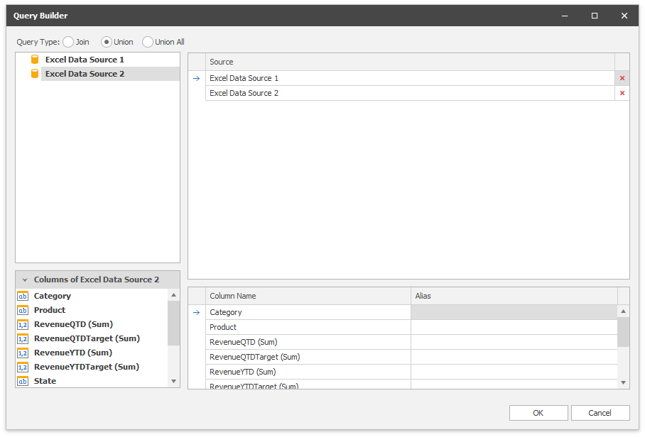
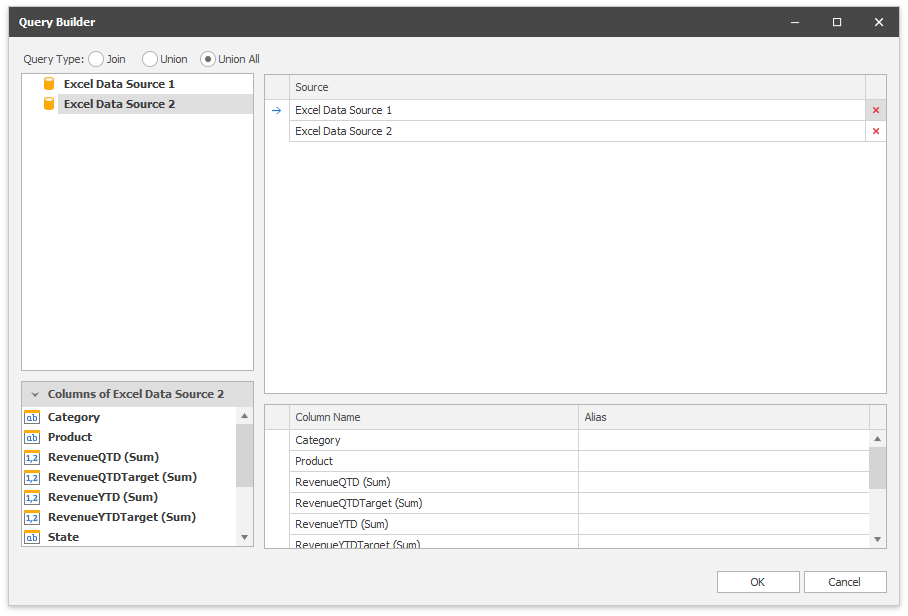

# Binding to Federated Data Source
>[!NOTE]
>The dashboard should have at least one **SQL**, **Object** or **Excel** data source already connected to it. Otherwise, the **Data Federation** option is not available in the **Data Source Wizard**.

To create a federated data source with the Data Source Wizard, perform the following steps:

1. Click the **New Data Source** button in the **Data Source** ribbon tab.

   

2. On the first page of the invoked **Data Source Wizard** dialog, select **Data Federation** and click **Next**.

   

3. The [Query Builder](../../dashboard-designer/working-with-data/using-the-query-builder.md) dialog displays available data sources.

   

4. Select the **Query Type**:

   **Join**

   Combines rows from two or more tables based on a shared column. The 'join' type specifies records with matching values in both tables.
     
    Drag-and-drop the required data sources, specify the related column (to create a relationship between tables), and select columns to include in the query. Columns included in the query are displayed in the bottom pane - where you can configure their settings.

   

   **Union**

   Combines rows from two or more tables into a single data set and removes duplicate rows in merged tables. You can only create a union query for data sources that contain similar columns with the same names. Data types of such columns should be [implicitly converted](https://docs.microsoft.com/en-us/dotnet/csharp/programming-guide/types/casting-and-type-conversions#implicit-conversions).

   Drag-and-drop the data sources to combine them in one. Unlike the join type, you cannot specify which columns to include in the union query. Columns included in the query are displayed in the bottom pane where you can specify the aliases of the newly created columns.

   

   **Union All** 

   Operates in the same manner as **Union**, but duplicates rows from different tables when they contain the same data.

   

   When you are finished, click **OK**.
 
5. The [Data Source Browser](../ui-elements/data-source-browser.md) displays the newly created Federation Data Source.

   The image below displays a new _Federation Data Source 1_ with a joined _SQlite Orders_ query.

   

    The query name is the same as the root table's name in the query builder. Click the **Rename** button in the **Query** group on the **Data Source** ribbon tab to change the query name.
