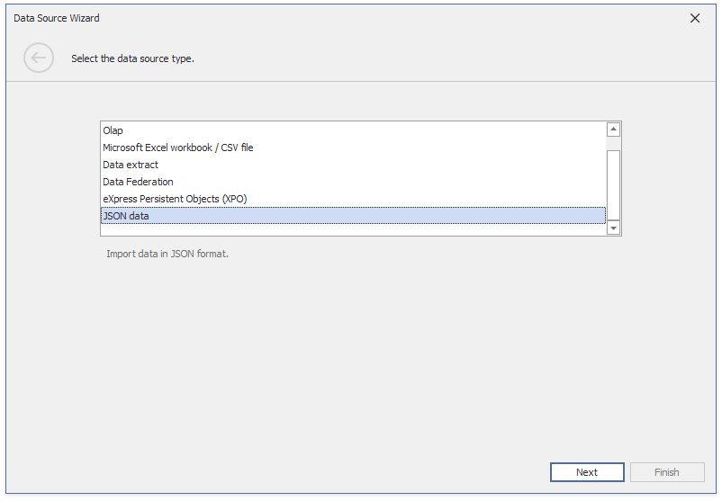
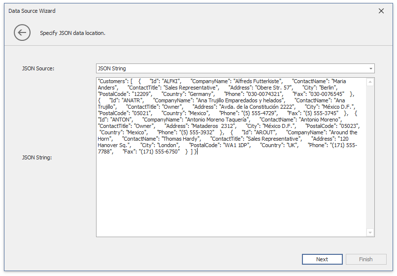
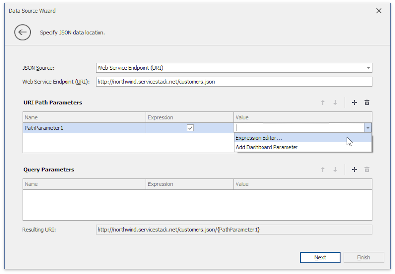
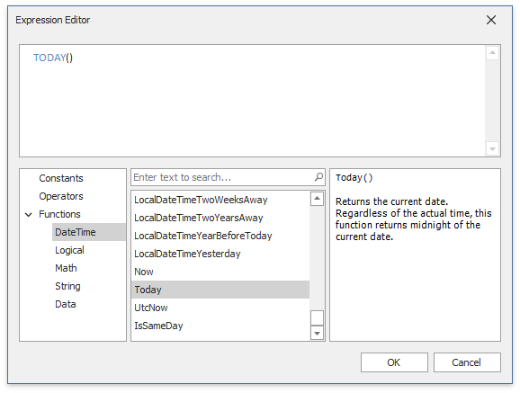
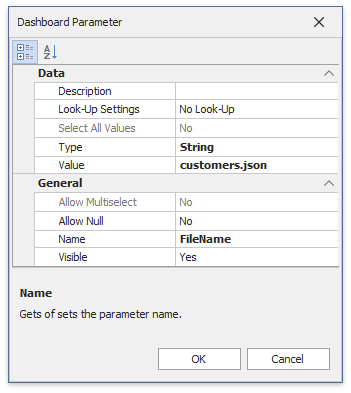
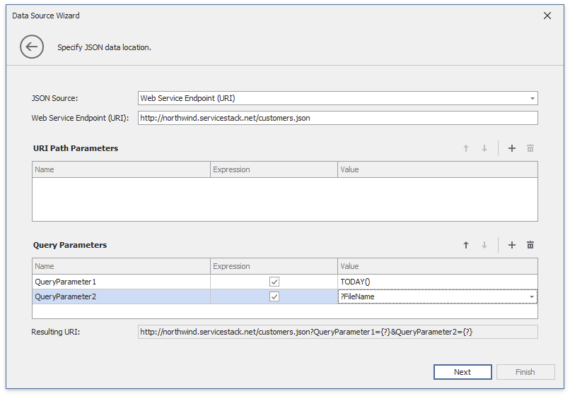
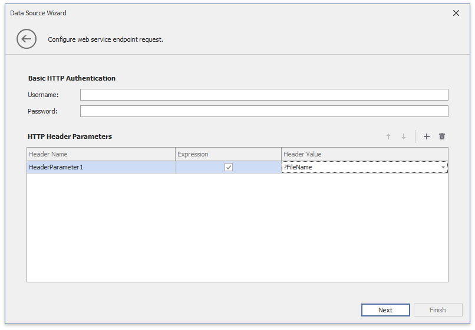

# Binding to JSON Data Sources

The Dashboard Designer allows you to connect to the JSON data source that retrieves data from a Web-service endpoint, text file or a string in JSON format.

## Create a New Data Connection

Follow the steps below to connect to the JSON data source:

1. Click the **New Data Source** button in the **Data Source** ribbon tab.

    

2. On the first page of the invoked **Data Source Wizard** dialog, select **JSON data** and click **Next**. 

    

## Configure a New Data Connection
   
3.  On the next page, configure a new data connection. 

    
     
    ### JSON String

    Specify a string that contains JSON data.

    

    Click **Next** to proceed to the [Select Data Fields](#select-data-fields) page.
       
    ### JSON File

    Specify the JSON data location to load content from the selected JSON file.

    

    Click **Next** to proceed to the [Select Data Fields](#select-data-fields) page.

    ### Web Service Endpoint (URI)

    Specify a URL to a file in JSON format and the Web Service Endpoint's request parameters (username and password, HTTP headers, query parameters or URI path parameters).

    - A **path parameter** appends a path element to a JSON endpoint's Uri.
    - A **query parameter** specifies an HTTP request parameter that is passed to a JSON endpoint.
    - A **header** is a custom HTTP header in JSON endpoint requests.

    You can use expressions and dashboard parameters to set path parameters, query parameter values and headers. Click the "+" icon to create a new parameter, enable the new parameter's **Expression** property and select **Expression Editor** from the **Value** property's drop-down list.

    

    Specify the expression in the invoked **Expression Editor** and click **OK**. 

    

    An expression can include [dashboard parameters](../data-analysis/using-dashboard-parameters.md). 

    > [!Tip]
    > Refer to the following help topic for details on how to create a dashboard parameter: [Create Parameters](../data-analysis/using-dashboard-parameters/creating-parameters.md).  

    Select **Add Dashboard Parameter** from the **Value** property's drop-down list, configure the dashboard parameter in the invoked **Dashboard Parameter** dialog, and click **OK**.  

    

    Path parameters and query parameters are included in endpoint requests in the order in which they are listed. Move a parameter up or down the list to change its position within an endpoint request.

    The read-only **Resulting URI** field displays the resulting JSON URI.

    

    Click **Next** to configure the basic HTTP authentication credentials and specify HTTP Header parameters. 

    

    Click **Next** to proceed to the [Select Data Fields](#select-data-fields) page.
    
## Select Data Fields

4. The "Select data fields" page allows you to include / exclude data fields used in a JSON data source.

    

    Click **Finish** to create a JSON data source.
