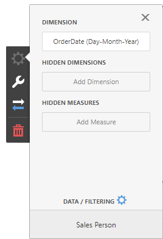
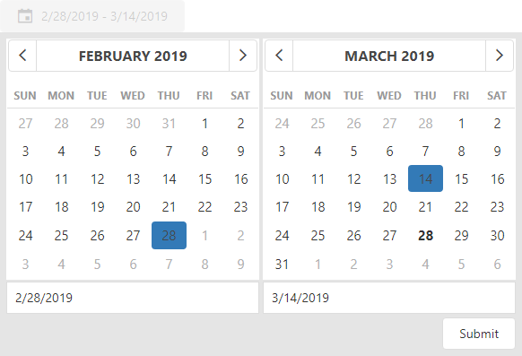
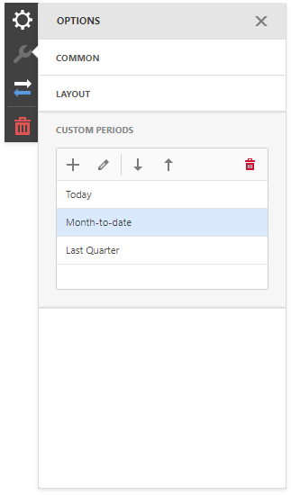
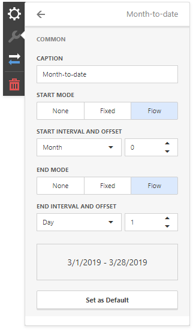
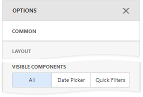

# Date Filter

The **Date Filter** dashboard item allows you to filter dashboard data based on the selected data range. The range can be relative (Last 3 Months), use fixed dates (01-01-2018), or presets (Month-to-date). You can also filter dates before or after a specified date. 

The Date Filter item displays a set of intervals that can be used as quick filters:

## Add a New Date Filter to the Dashboard

To create a Date Filter item, click the **Date Filter** item in the [Toolbox](../ui-elements/toolbox.md) **Filter** section:

## Bind to Data

Click the **Dimension** placeholder in the data section and select the required data source field in the **Binding** section of the invoked [data item menu](../ui-elements/data-item-menu.md) to bind the Date Filter to data.

For details, see the [Binding Dashboard Items to Data](../binding-dashboard-items-to-data.md) topic.

## Date Picker

The Date Filter item displays a **Date Picker** that is a button with a drop-down calendar. A drop-down calendar allows the end-user to select a single date or a date range:

You can configure whether to display the Date Picker in the Date Filter item. For this, go to the Date Filter's [Options](../ui-elements/dashboard-item-menu.md) menu, open to the **Layout** section and specify the **Visible Components** setting.

## Display Format

To specify the date-time value format, use the **Format Type** option in the **Format** section of the [data item menu](../ui-elements/data-item-menu.md), as described in the Formatting Data topic.

To specify a custom string displayed in the Date Picker component, go to the dashboard item [Options](../ui-elements/dashboard-item-menu.md) menu, open the **Layout** section and fill in the **Display Text Pattern** text field:

You can include placeholders in a custom string. The `{0}` placeholder is the interval's start, the `{1}` placeholder is the interval's end.

## Create Quick Filters

**Quick Filters** are buttons displayed within the Date Filter item. Each button is bound to a predefined date-time period that can be used to perform a selection. You can click the button to apply a custom period to a Date filter:

The **Select Date Time Period** button displayed in the Date Filter caption invokes the drop-down list with quick filters.

To add quick filters, open the Date Filter's [Options](../ui-elements/dashboard-item-menu.md) menu and go to the **Custom Periods** section. Click "+" to add a new period:

Click the _edit_ icon to invoke the editor's panel and configure a custom period. The following image illustrates how to modify the **Month-to-Date** custom period:

You can specify the following settings for the start/end boundaries:

* **Caption** - Specifies a predefined period caption.
* **Start Mode** - Specifies a mode of the start boundary.
* **End Mode** - Specifies a mode of the end boundary.

The following modes used to set predefined ranges are available:

* **None** - The selection will begin from the start/end of the visible range.
* **Fixed** - Allows you to select a specific date value using the calendar. Use the **Start/End Date** option to set a value.
* **Flow** - Allows you to select a relative date value. The **Interval** option specifies the interval between the current date and the required date. The **Offset** option allows you to set the number of such intervals.

> [!NOTE]
> Note that the **Offset** option can accept **negative** and **positive** values. Negative values correspond to dates before the current date, while positive values correspond to future dates.

## Arrange Quick Filters

Quick filters in the Date Filter item can be arranged horizontally or vertically. The default mode is _auto height_, in which quick filters are displayed horizontally and the dashboard item shrinks automatically to fit the items and save space.

To specify the arrangement mode, go to the dashboard item [Options](../ui-elements/dashboard-item-menu.md) menu, open the **Layout** section and specify the **Arrangement Mode** setting:

The Date Filter item can display the date picker with quick filter buttons (default), or only the date picker, or only quick filters. To specify which visible components to display, go to the dashboard item Options menu, open the **Layout** section and configure the **Visible Components** setting:

