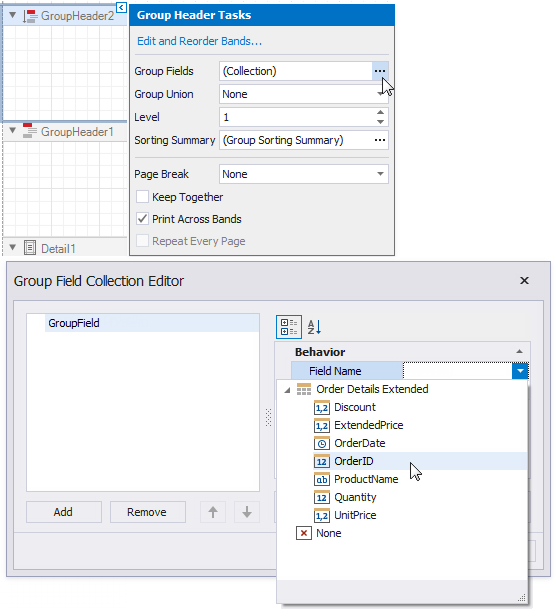
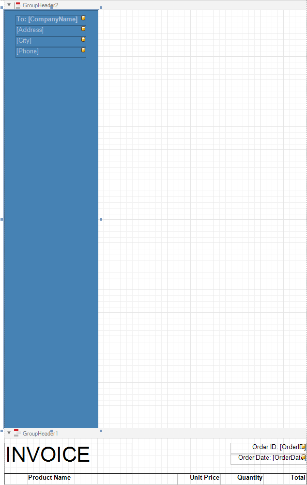
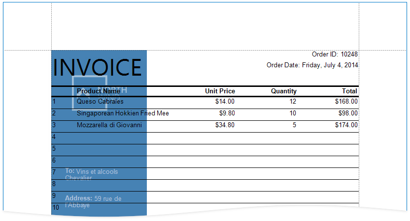

# Create a Report with Cross-Band Content and Populated Empty Space

This tutorial describes how to create an invoice report with the following layout options:

- Print part of the content across bands (the blue panel);
- Populate the empty space between the detail and footer information with blank rows.

This topic assumes that you have a report that groups data source data into invoices and prints each invoice on a separate page.

## Add Line Numbers

1. Right-click the first cell in the [Detail band](../introduction-to-banded-reports.md)'s table and select Insert / Column to Left from the context menu.

	

1. Select the new cell and specify the following property values:

	* **Summary**: _Group_
	* **Expression**: _sumRecordNumber()_

	

	Each row now includes a row number.

## Populate the Empty Space

Add empty lines to invoices to populate the empty space between the _Detail_ band's data and the totals.

Click the _Detail_ band's smart tag and check the **Fill Empty Space** property.

Each invoice now includes the numbered lines that continue until the totals.

## Add Cross-Band Data

Add a panel with recipient details across the entire group. Place the panel on a separate _GroupHeader_ band that is printed on the background of other bands.

1. Right-click the design surface. Select **Insert Band** / **GroupHeader** from the context menu.

	

1. Click the added band's smart tag and set the **Print Across Bands** property. This makes the band content start at the top of the _GroupHeader1_ and end at the bottom of the _GroupFooter1_ band.

	

	> [!Tip]
	> Choose a _PageHeader_ band instead of the _GroupHeader_ to limit the cross-band content to a page, even if the _GroupFooter_ is on the next page.

2. As the new _GroupHeader_ band is above the header, it is not included in the grouping. Move the group fields from the previous _GroupHeader_ band to the new band. Click _GroupHeader1_'s smart tag, click the **Group Fields** property's ellipsis button and remove group fields from the invoked **Group Field Collection Editor**. Then click _GroupHeader2_'s smart tag, click the **Group Fields** property's ellipsis button and add the same group fields.

	

1. Add a [Panel](../use-report-elements/use-basic-report-controls/panel.md) control to the _GroupHeader_. Specify the panel's **Background Color** and drop fields onto the panel.

	

4. Adjust the panel's width and height. The height should match the page height, as the _GroupFooter_ is printed at the bottom of the page.

	

1. Switch to Print Preview. The panel is printed on the background of the group content.

	

1. Adjust the content in other bands to print it side-by-side with the panel.

	

See the final report in Print Preview.

