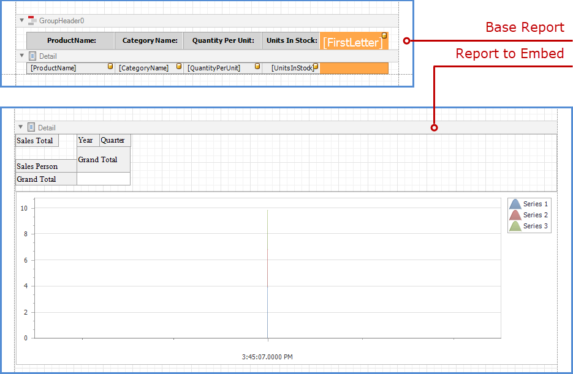
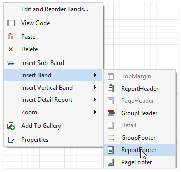
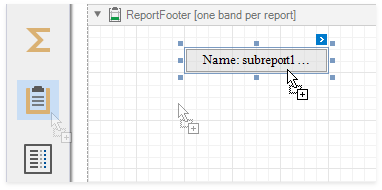
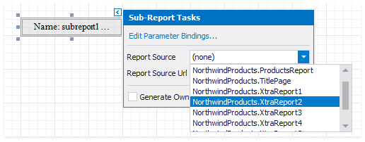
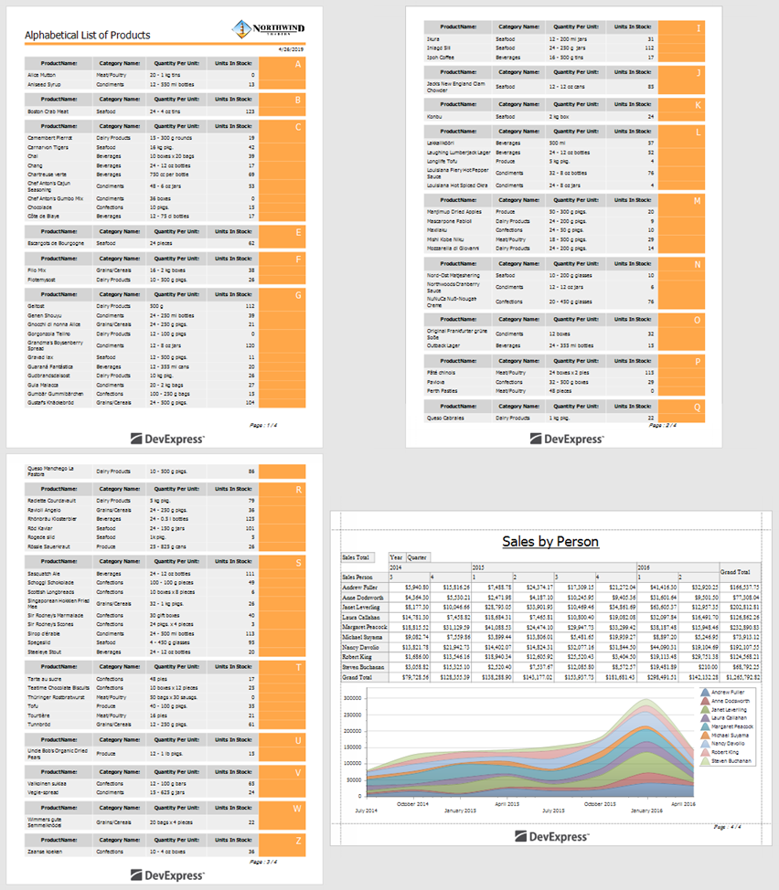

# Add a Report to the End/Beginning

Follow the steps below to add a separate report to the end of another report and print it as a single job.

1. Right-click the base report and select the **Insert Band** / **Report Footer** item in the context menu.

	

1. Drag a [Subreport](../use-report-elements/use-basic-report-controls/subreport.md) item from the Toolbox onto the created Report Footer band.

	

    > [!Tip]
    > To add a report to the beginning of another report (for instance, to add a title page), use the **Report Header** band instead.

1. Click the subreport's smart tag. In the invoked **Sub-Report Tasks** window, specify the report that you want to insert:

    * If you have a pre-defined report, set it in the **Report Source** parameter.
    * If you want to use a customized pre-defined report, or if you have a sub-report saved to your hard drive, set it in the **Report Source Url** parameter.

    

1. Enable the **Generate Own Pages** option to print the embedded report on separate pages and use its own page settings.

    

1. Switch to Preview mode to see the combined report.

    
