# Calculate a Weighted Average

> [!NOTE]
> Use this approach if data bindings **are enabled** in the Report Designer. (the Label's smart tag includes the **Data Binding** parameter).
>
> 
>
> See the [Calculate a Weighted Average](../shape-data-expression-bindings/calculate-a-weighted-average.md) topic in the [Shape Data (Expression Bindings)](../shape-data-expression-bindings.md) section to learn about the alternative approach.

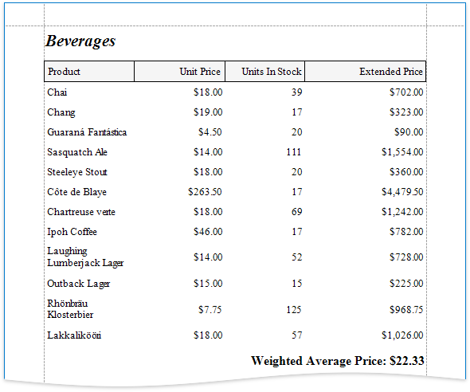

Use one of the following approaches to calculate weighted average data:

## Aggregate Functions

You can create a [calculated field](../use-calculated-fields/calculated-fields-overview.md) and use a standard aggregate function in its expression to evaluate a weighted average at the report level.

1. [Open an existing report](../../open-reports.md) or [create a new one from scratch](../../add-new-reports.md).
2. [Bind a report](../../bind-to-data.md) to a required data source.
3. Right-click any item in the [Field List](../../../../../articles/report-designer/report-designer-for-winforms/report-designer-tools/ui-panels/field-list.md)'s data source node, and in the invoked context menu, select **Add Calculated Field**.

	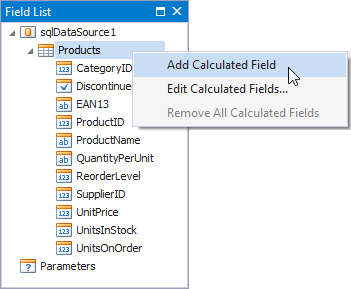

4. Select the created calculated field and switch to the **Properties** window. Specify the **Name** property, set the **Field Type** to Decimal and click the Expression property's ellipsis button.

	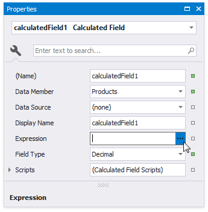

5. In the invoked Expression Editor, specify an aggregate expression:

    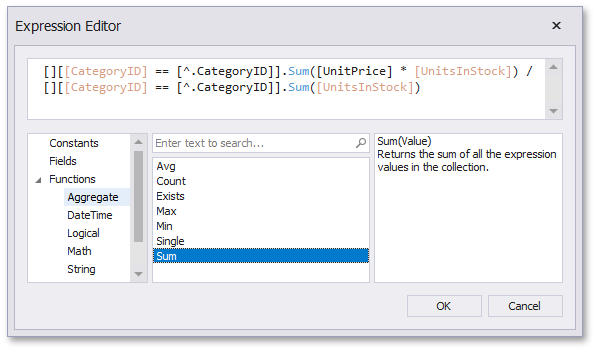

    To construct a valid aggregate expression, use the following format:

    [&lt;Collection>][&lt;Condition>].&lt;Aggregate>(&lt;Expression>)

    * &lt;Collection> - Specifies a collection to calculate an aggregated value against. It can be the relationship name for a master-detail relationship, or a collection property's name exposed by the target class. For example, [CategoriesProducts][[CategoryId]>5].Count(). Empty brackets [] indicate the root collection.
    * &lt;Condition> - Specifies a condition that defines which records to use for the aggregate function calculation. To calculate an aggregated value against all records, delete this logical clause and its square brackets (for example, [].Count()).
    * &lt;Aggregate> - Specifies one of the available aggregate functions listed in the Aggregate enumeration.
    * &lt;Expression> - Specifies the expression to use. For example, [][[CategoryID] > 5].Sum([UnitPrice]*[Quantity]). The Count function does not require field values to count the records (the round brackets can be empty for this function).

    Use the Parent Relationship Traversal Operator ('^') to refer to the processed group (for instance, [][[^.CategoryID] == [CategoryID]].Sum([UnitPrice])). This allows you to calculate aggregates within groups.

    For more information, see [Expression Constants, Operators, and Functions](../../../../../articles/expression-editor/expression-operators-functions-and-constants.md).

6. Add the created calculated field to the report as an ordinary data field and format its value.

## Data Source Level

Use a **sqlDataSource** component to calculate summaries at data source level. You can use these summaries as regular data fields in your report. Then, create a [calculated field](../use-calculated-fields/calculated-fields-overview.md) where your expression uses these fields.

1. When you use the [Report Wizard](../../../../../articles/report-designer/report-designer-for-winforms/report-designer-tools/report-wizard.md) or [bind a report to an SQL data source](../../../../../articles/report-designer/report-designer-for-winforms/bind-to-data/bind-a-report-to-a-database.md), go to the [query customization](../../../../../articles/report-designer/report-designer-for-winforms/report-designer-tools/data-source-wizard/connect-to-a-database/create-a-query-or-select-a-stored-procedure.md) page and click the  button for the **Queries** category. Then use the [Query Builder](../../../../../articles/report-designer/report-designer-for-winforms/report-designer-tools/query-builder.md) to create a new query.

	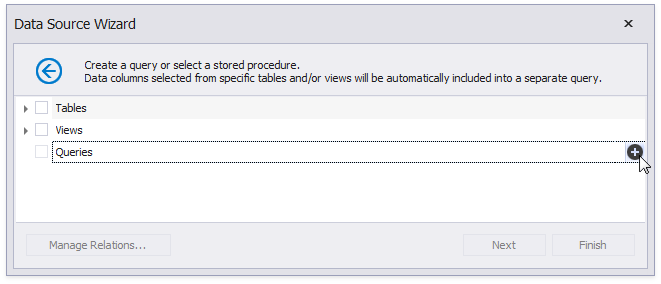

	To customize a data source, right-click the data source in the [Report Explorer](../../../../../articles/report-designer/report-designer-for-winforms/report-designer-tools/ui-panels/report-explorer.md) or [Field List](../../../../../articles/report-designer/report-designer-for-winforms/report-designer-tools/ui-panels/field-list.md) and select **Manage Queries** in the context menu.

	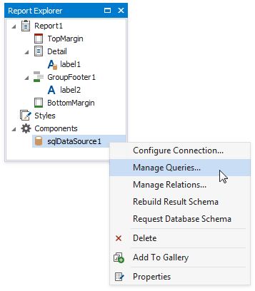

	In the invoked **Manage Queries** dialog, click the query's ellipsis button.

	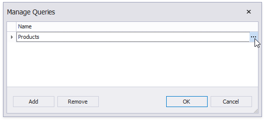

	In the invoked editor page, click the **Run Query Builder** button.

	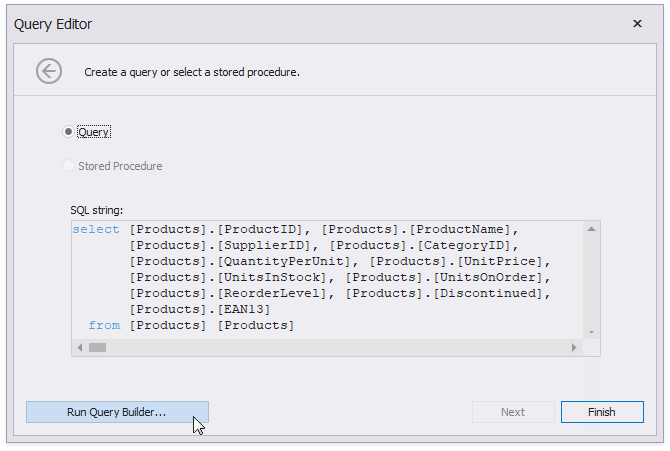

2. In the **Query Builder**, add tables to the query. Enable the fields' checkboxes to include them in the query.

	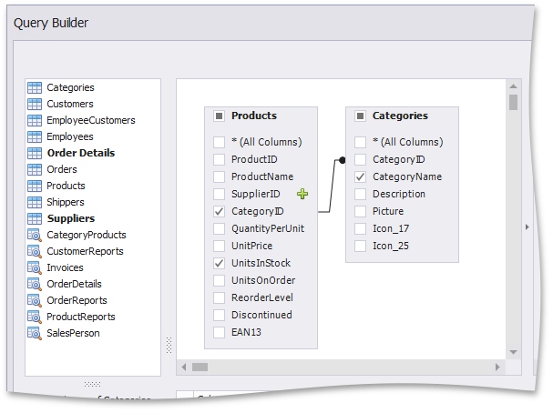

3. In the column list under the data source editor, group data by the group fields and apply the **Sum** aggregate function to the **UnitsInStock** field.

	

4. Click a new column's expression ellipsis button. In the invoked **Expression Editor**, specify an expression that multiplies the averaged field and the weight field as in the image below:

	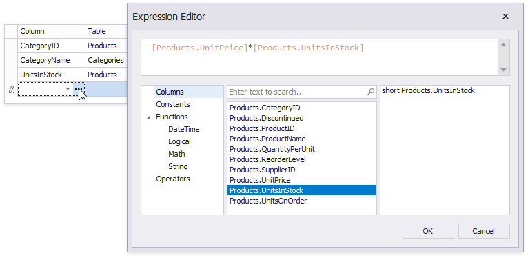

5. Apply the **Sum** aggregate function to the previously created column as well.

	The image below shows the created query.

	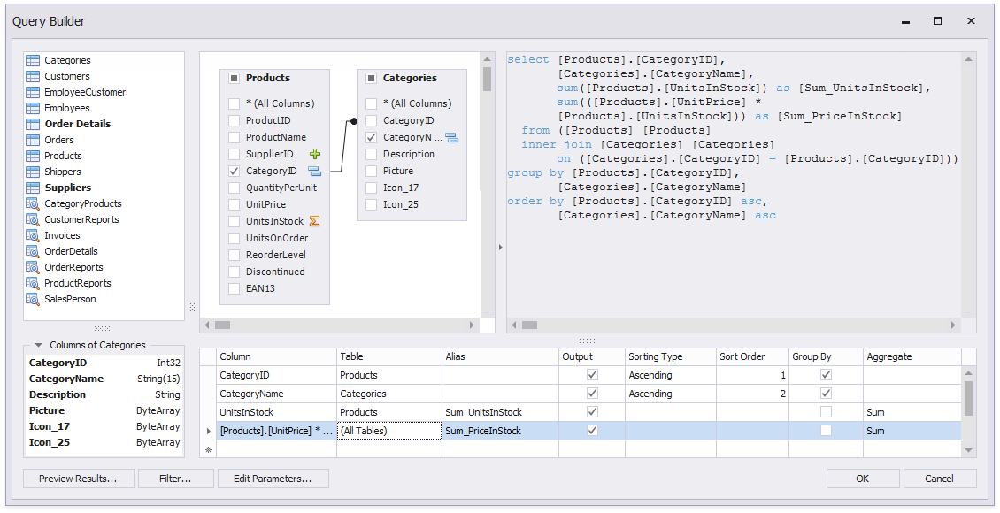

6. Click **OK** to complete the **Query Builder**, then click **Finish** to exit the wizard.

7. Go to the [Field List](../../../../../articles/report-designer/report-designer-for-winforms/report-designer-tools/ui-panels/field-list.md), right-click any item inside the data source node. In the invoked context menu, select **Add Calculated Field**.

	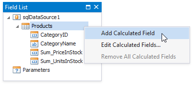

8. Right-click the created calculated field and select **Edit Expression**.

	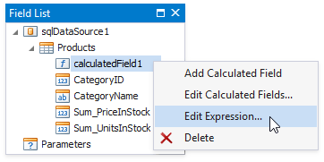

9. In the invoked **Expression Editor**, construct the expression and click **OK**:

	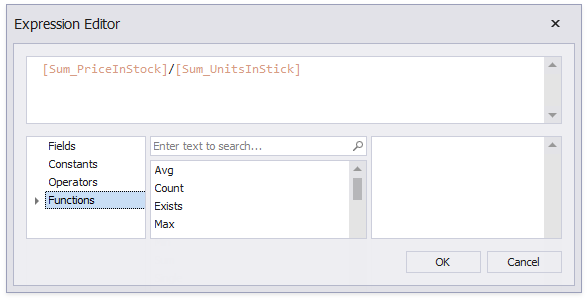

10. Add the created calculated field to the report as an ordinary data field and format its value.