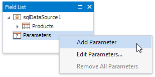
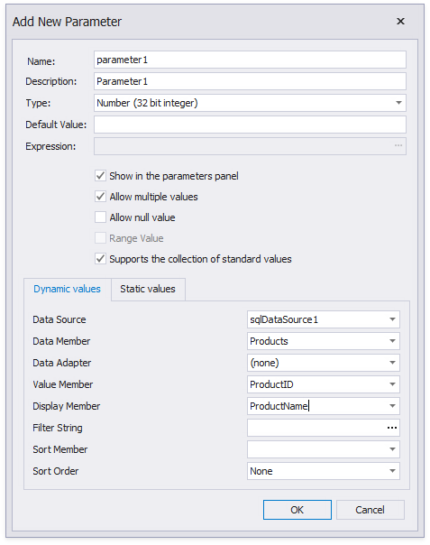
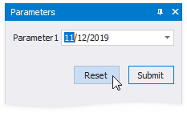
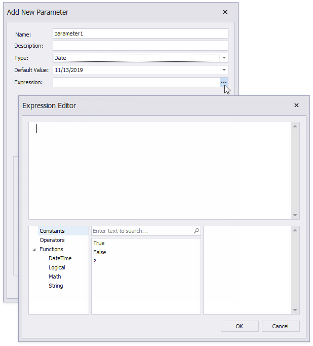
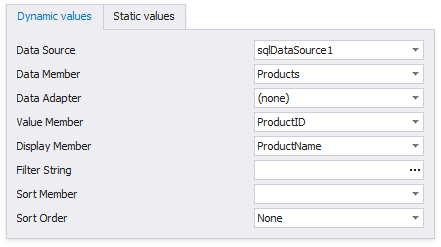
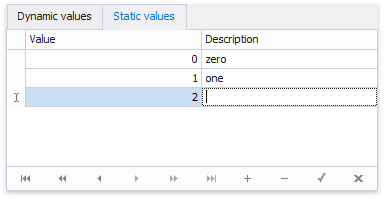
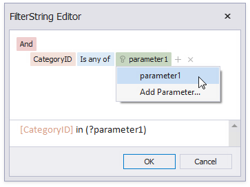
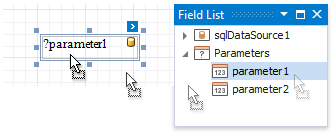
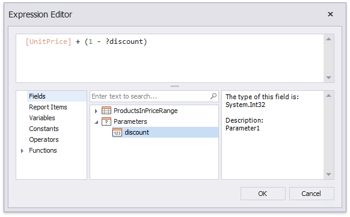

# Parameters Overview

You can use report parameters to pass data to a report before it has been published. Parameter values are specified in Print Preview's **Parameters** panel.

## Add Parameters

Switch to the [Field List](../../report-designer-tools/ui-panels/field-list.md), right-click the **Parameters** node and click **Add Parameter** in the context menu to create a report parameter.

Alternatively, you can click the **Add Parameter** button in the [Toolbar](../../report-designer-tools/toolbar.md)'s **Home** tab.

This invokes the **Add New Parameter** dialog where you can configure the created parameter.

The dialog provides the following options:

* **Name**  
	Specifies the unique name by which you can refer to the parameter.
* **Description**  
	Specifies the text that appears in Print Preview alongside with the value editor.
* **Type**  
	Specifies the parameter's value type. A value editor for the specified type is displayed in Print Preview.
* **Default value**  
	Specifies the parameter's **Value**. When users change a parameter's value in Print Preview, they can press **Reset** to return to the default value.

	

* **Expression**  
	Specifies an expression that defines the parameter's value based on specific conditions. Click the **Expression** property's ellipsis button and construct an expression in the invoked **Expression Editor**.

	

* **Show in the parameters panel** (corresponds to the parameter's **Visible** property)  
	Enable this option to request the parameter value in Print Preview. Otherwise, the report assumes the default parameter value.
* **Allow multiple values** (corresponds to the parameter's **Multi-Value** property)  
	Enable this option to allow a parameter to accept a [collection of values](create-multi-value-and-cascading-parameters.md).
* **Allow null value** (corresponds to the parameter's **Allow Null** property)  
	Enable this option if the parameter's value can be unspecified.
* **Range Value**  
	Enable this option if the parameter should specify a range with a start value and an end value. This option applies to _Date_-type parameters. See [Date Range Parameters](date-range-parameters.md) for information on how to configure a date range parameter.
* **Supports the collection of standard values**  
	Applies if the parameter is visible (its value is requested in Print Preview). A user can choose a value from a predefined list. You can populate this list with static values, or specify a data source from where the values are obtained.

	* **Dynamic values**

		Specify a data source, data adapter and data member for the parameter values storage. **Value Member** defines a data field that provides values to the parameter. **Display Member** defines a data field that stores values displayed in Print Preview.
		
		
		
		The specified data member's value type should match the specified parameter type.
		
		Use the **Filter String** property to filter parameter values and implement [cascading parameters](create-multi-value-and-cascading-parameters.md).

		Specify the **Sort Member** and **Sort Order** properties to sort parameter values.
		
	* **Static values**
		
		Switch to this tab to specify a static list of values. Each value should have a description that is displayed in Print Preview.
		
		

## Use Parameters

Report parameters pass data to a report before it has been generated in Print Preview. You can let users specify parameter values.

Use report parameters in the following cases:

* **Filter**

	Parameters can provide values to a report's **Filter String** to [filter report data](../filter-data/filter-data-at-the-report-level.md).

	

	You can link the report parameter to [query parameters](use-query-parameters.md) used in the SQL string's SELECT statement to [filter data at the data source level](../filter-data/filter-data-at-the-data-source-level.md).

* **Bind to Data**
	
	You can bind a report control to a parameter and display its value in a report. To create a new [label](../../use-report-elements/use-basic-report-controls/label.md) bound to a parameter, drag the parameter from the [Field List](../../report-designer-tools/ui-panels/field-list.md) and drop it onto a band.
	
	
	
	You can refer to a parameter in [mail merge](../../bind-to-data/use-embedded-fields-mail-merge.md). Add a question mark in front of the parameter's name.

	

* **Specify Expressions**
    
    You can include parameters into [expressions](../../use-expressions.md). Use a question mark (?) in front of a parameter's name.

    