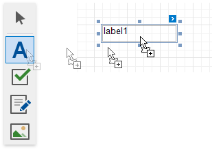
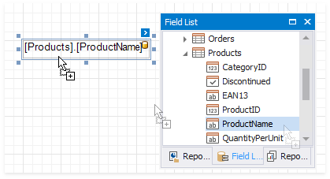
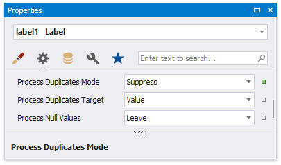
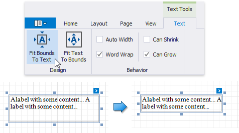
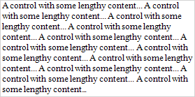
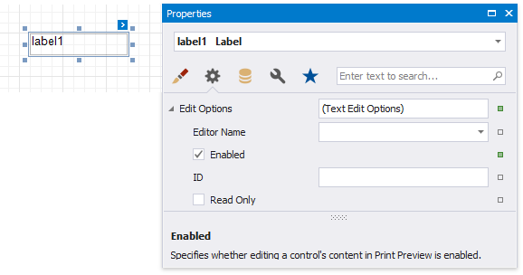
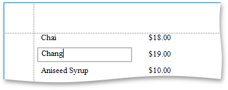

# Label

## Label Overview

The **Label** control displays plain text in a report. Drag the **Label** item from the [Toolbox](../../report-designer-tools/toolbox.md) onto the report's area to add a Label control to it.

Double-click the label to invoke its in-place editor and enter the desired static text.

Press CTRL+Enter to submit text changes and exit the label's in-place edit mode.

## Bind to Data
### Display Field Values

You can [bind](../../bind-to-data/bind-controls-to-data-expression-bindings.md) the label's **Text** property to a data field obtained from a report's data source. Click the control's smart tag, expand the **Expression** drop-down list and select the data field.

Click the **Expression** option's ellipsis button to invoke the **Expression Editor**. You can use this editor to construct a complex binding expression that involves two or more data fields.

You can also drag and drop a numeric or text field from the [Field List](../../report-designer-tools/ui-panels/field-list.md) to create a new label bound to this field.

See the [Bind Controls to Data](../../bind-to-data/bind-controls-to-data-expression-bindings.md) topic for more information.

The **Process Duplicates Mode**, **Process Duplicates Target** and **Process Null Values** options enable you to hide a control when a duplicated or null value appears in an assigned data source.

You can also use the **Format String** property to specify output values' [format](../../shape-report-data/shape-data-expression-bindings/format-data.md).

### Display Summaries

Specify a data range in the **Summary Running** property and select the summary function in the **Summary Expression Editor** to make the label display a [summary function's result](../../shape-report-data/shape-data-expression-bindings/calculate-a-summary.md).

## Adjust the Label Size and Content
### Static Content

You can change label size at design time to fit its static text. Right-click the label and select the **Fit Bounds To Text** toolbar button:

* If the **Word Wrap** option is enabled, the command displays control content on multiple lines. It reduces control height and adjusts the width to fit its content.

	

* If the **Word Wrap** option is disabled and the control's content is partially visible, the command adjusts the control size to display this content.

	

The command's result also depends on the control's **Text Alignment** and **Right To Left** settings.

Use the **Fit Text To Bounds** button to adjust the control's font size to fit its area. The **Word Wrap** option defines whether the text can occupy multiple lines or should be in a single line.

These commands are not available in the following cases:

* A label's text is an empty string;
* A label's text is bound to data;
* A label's **Angle** property is specified.

### Data-Bound Labels

The **Can Grow** and **Can Shrink** properties allow you to increase or decrease the control's height according to its content in Print Preview mode.

| Can Grow is enabled | Can Grow is disabled |
|---|---|
|  |  |

| Can Shrink is enabled | CanShrink is disabled |
|---|---|
|  |  |

The **Auto Width** property specifies whether or not to adjust a data-bound label's width to its content.

You can also use the opposite **Text Fit Mode** property to adjust a control's font size to fit its boundaries in Print Preview mode. This property is not available if the **Can Grow**, **Can Shrink** or **Auto Width** option is enabled.

| Text Fit Mode = None | Text Fit Mode = Grow Only | Text Fit Mode = Shrink Only | Text Fit Mode = Shrink And Grow |
|---|---|---|---|
|  |  |  |  |

See the [Arrange Dynamic Report Content](../../lay-out-dynamic-report-content.md) topic for more information.

## Interactivity

Check the **Enabled** option in the **Edit Options** category to enable users to [edit a label's content](../../provide-interactivity/edit-content-in-print-preview.md) in Print Preview mode.

Click this label in a previewed document to invoke the editor.

Use the label's **Interactive Sorting** option to allow users to click this label in Print Preview to sort report data. Set the **Target Band** property to the required Group Header or Detail band, and specify the data field in the **Field Name** property.

Refer to [Sort a Report in Print Preview](../../provide-interactivity/sort-a-report-in-print-preview.md) for a step-by-step tutorial.

## Markup Text

Enable the **Allow Markup Text** property to format the label's text with markup tags.

**Label** supports the following tags:

| Tag | End Tag | Description |
| --- | ------- | ----------- |
| **&lt;br&gt;** |   | Inserts a single line break. Enable the **WordWrap** property to use this tag. |
| **&lt;nbsp&gt;** | - | Inserts a space. |
| **&lt;color**=_value_**&gt;** | **&lt;/color&gt;** | Specifies the text color. |
| **&lt;backcolor**=_value_**&gt;** | **&lt;/backcolor&gt;** | Specifies the background color. |
| **&lt;size**=_value_**&gt;** | **&lt;/size&gt;** | Specifies the font size. |
| **&lt;b&gt;** | **&lt;/b&gt;** | Defines bold text. |
| **&lt;i&gt;** | **&lt;/i&gt;** | Defines italic text. |
| **&lt;s&gt;** | **&lt;/s&gt;** | Defines strikethrough text. |
| **&lt;u&gt;** | **&lt;/u&gt;** | Defines underlined text. |
| **&lt;image=**_value_**&gt;**  | - | Inserts an image from the report's named image collection. Supports both raster images and SVG images. Use the report's **Image Resources** property to provide images and reference them by their **Id**. The **image** tag's **size** attribute sets the image display pixel size. If the specified width/height exceeds the label's width/height, it is reduced to display the entire image. Specify the **size** attribute after the tag's value followed by the ";" character. |
| **&lt;href=**_value_**&gt;** | **&lt;/href&gt;** | Displays a hyperlink. The value string specifies the hyperlink source, and the string between the opening and closing tags is the text to display. |