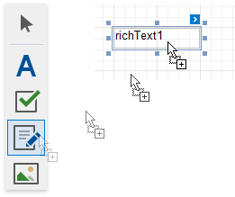
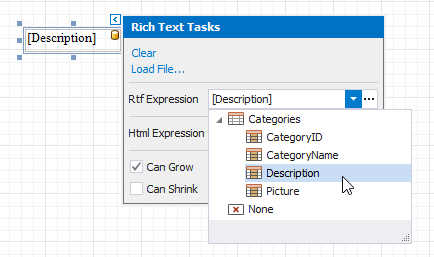

# Rich Text

## Overview
The **Rich Text** control displays formatted text (static, dynamic or mixed) in your report.

To add this control to a report, drag the **Rich Text** item from the [Toolbox](../../report-designer-tools/toolbox.md) onto the report's area.

You can load RTF or HTML content from an external file. Click the control's smart tag and select **Load File**.

In the invoked **Open** dialog, use the drop-down list to define the file's extension (**.rtf**, **.docx**, **.txt**, **.htm** or **.html**), select the file and click **Open**.

You can double-click the Rich Text to invoke its in-place editor and enter static text. Use the [Toolbar](../../report-designer-tools/toolbar.md)'s **Font** group to format the text. 

Press CTRL+Enter to submit changes and exit the in-place editor.

> [!NOTE]
> The Rich Text's content is exported as plain text only when exporting to XLS or XLSX format.

## Bind to Data

You can [bind](../../bind-to-data/bind-controls-to-data-expression-bindings.md) the control's **RTF** property to a data field obtained from a report's data source. Click the control's smart tag, expand the **Rtf Expression**'s drop-down list and select the data field.
 

You can bind the control to a data field that provides HTML content in the same way. To do this, click the control's smart tag and use the **Html Expression**'s drop-down list.

Click the **Rtf Expression** or **Html Expression** option's ellipsis button to invoke the **Expression Editor**. This editor allows you to construct a complex binding expression with two or more data fields. 

You can also drag and drop any field from the [Field List](../../report-designer-tools/ui-panels/field-list.md) with the right mouse button and select the **Rich Text** menu item. This creates a new Rich Text control bound to this field.

The Rich Text also enables you to merge data fields and static content in its text. 

See the [Bind Controls to Data](../../bind-to-data/bind-controls-to-data-expression-bindings.md) and [Use Embedded Fields](../../bind-to-data/use-embedded-fields-mail-merge.md) topics for more information.

## Markup Text

### Supported Tags

The table below lists the supported HTML tags. External links are processed for inline pictures and style sheets (CSS files). The ID and Class attributes are interpreted for all tags, including the unlisted ones. These attributes are used to specify a style applied to the document part defined by a certain tag.

| Tag | Attributes | Notes |
---------|----------|---------
| a | dir |  |
| b | dir |  |
| base |  |  |
| basefont | size color face dir |  |
| big | dir |  |
| blockquote | dir |  |
| br | dir |  |
| center | dir |  |
| code | dir |  |
| del | cite datetime |  |
| div | page-break-before page-break-after page-break-inside background-color border (CSS) dir | Only the **always** property value is supported for the **page-break-before** tag. |
| em | dir |  |
| font | size color face dir |  |
| h1-h6 | align dir | |
| head |  |  |
| html |  |  |
| hr | align color noshade size width |  |
| i | dir |  |
| ins | cite datetime |  |
| img | align src height width | If the **align** attribute is not specified, the image is considered as inline. |
| li | type value dir |  |
| link | href type media dir |  |
| meta |  |  |
| ol | type value align dir |  |
| p | align dir |  |
| script |  | Text inside this tag is ignored. |
| small |  |  |
| span |  |  |
| strike | dir |  |
| strong | dir |  |
| style |  |  |
| sub | dir |  |
| sup | dir |  |
| table | align bgcolor border bordercolor cellpadding cellspacing dir width | The **dir** attribute reorders table columns. |
| td | align bgcolor bordercolor colspan height nowrap rowspan text-align valign width | The **align** tag is supported in the Internet Explorer only. The **Rich Text** control's interpretation of the **bordercolor** attribute is different from the HTML browser. |
| th | any allowed |  |
| tr | align bgcolor bordercolor height text-align valign | The **align** attribute is supported in the Internet Explorer only. |
| title |  | Text inside this tag is ignored. |
| u | dir |  |
| ul | dir |  |

### Unsupported Tags

* &lt;base&gt; tag with _href_ attribute;
* &lt;div&gt; tag with _border_, _align_ and _float_ CSS attribute;
* &lt;li&gt; tag with _list-style-image_ CSS attribute;
* &lt;margin&gt; tag;
* &lt;tab&gt; tag;
* &lt;table&gt; tag with _cols_ attribute;
* &lt;td&gt; tab with _bordercolor_ and _nowrap_ attributes;
* _!important_ declaration;
* _word-wrap_ and _break-word_ css properties;
* css3 shapes;
* &lt;ui&gt; tag with _type_ attribute.

### Export to Excel

When a report is exported to XLS, the following rich-text content is converted from **Rich Text** controls into Excel-native rich-text content:

| | HTML Tags and RTF Equivalents |
| --- | --- |
| Text format | \<b>, \<i>, \<u>, \<s>, \<strong>, \<em> |
| Line break | \  |
| Non-breaking space | \&nbsp; |
| Font | \ |
| Font size | \ |
| Foreground color | \ |
