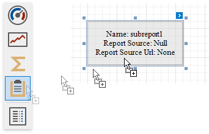

# Subreport

The **Subreport** control is used to embed other reports into the current report.

To add this control to a report, drag the **Subreport** item from the [Toolbox](../../report-designer-tools/toolbox.md) onto the report's area.

The Subreport control allows you to solve the following tasks:

* **Reuse reports**, if there is a particular report structure (template) that needs to be included in many reports, for instance, a report header that always contains the same information (the company information, logo, date, etc.).

* [Create master-detail reports](../../create-popular-reports/create-a-master-detail-report-use-subreports.md)
* [Merge reports](../../merge-reports.md)

Use one of the following properties to provide the report source:

* **Report Source**

    Determines a report to be included as a subreport.

    If report classes of the application that invoked the Report Designer are compiled into one assembly, then they are available as items in this combo box.

* **Report Source URL**

    Defines a URL of a report file (*.REPX), to use as a report source.

Double-click a subreport to open its associated report in a new Report Designer tab.