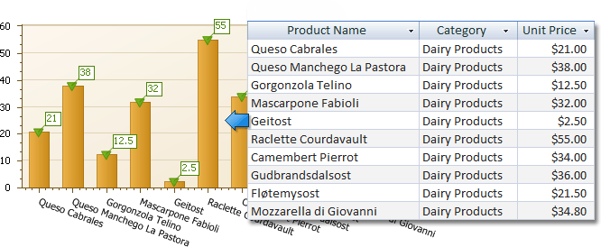
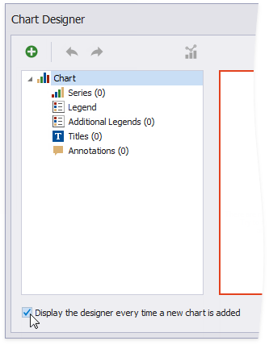
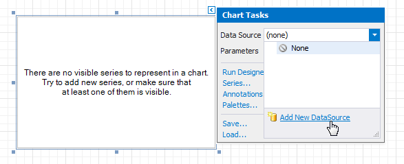
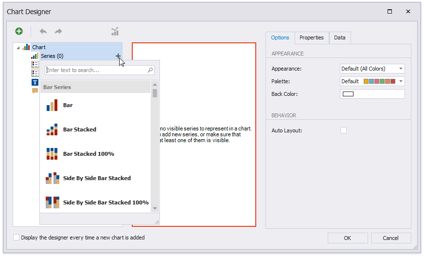
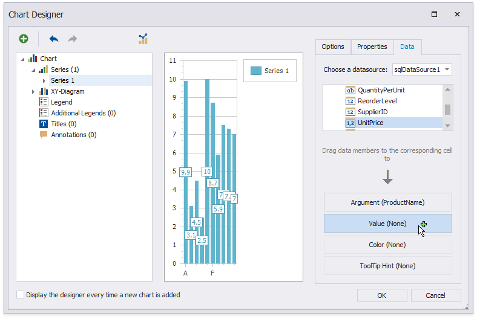
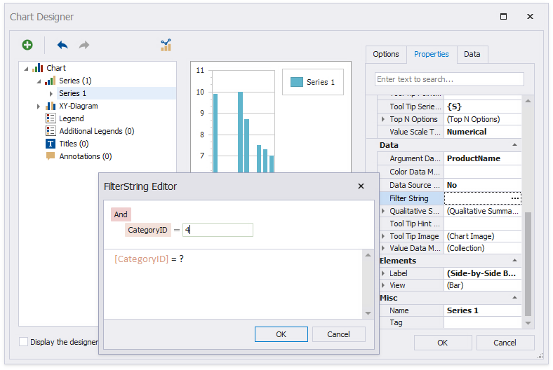
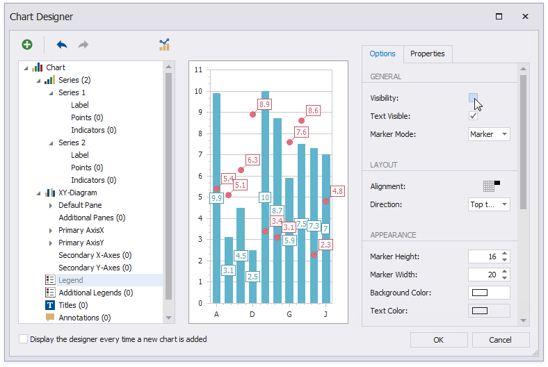
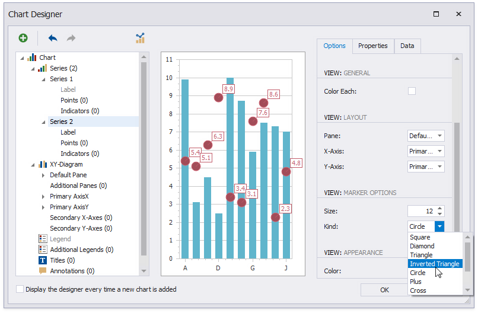
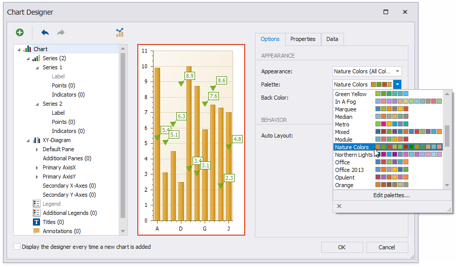
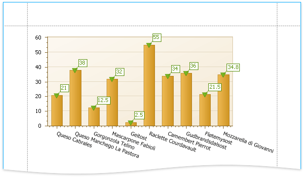

# Add a Chart (Set Up Series Manually)

This document demonstrates how to add a chart to a report, provide data for chart series, and set up chart elements. This topic shows two chart series based on the same data source. You can use different data sources for different series.

## Add a Chart to a Report

1. Drop the **Chart** control from the [Toolbox](../../report-designer-tools/toolbox.md) onto the [Detail band](../../introduction-to-banded-reports.md).

    

    The **Chart Designer** wizard is invoked. Disable the **Display the designer every time a new chart is added** option if you do not want to trigger the wizard the next time you create a chart.

    

    Close the wizard at this stage.

2. Click the chart's [smart tag](../../../../../articles/report-designer/report-designer-for-winforms/use-report-elements/manipulate-report-elements/select-report-elements-and-access-their-settings.md) to bind the chart to data. Expand the **Data Source** property's drop-down and click **Add New Data Source**.

    

3. The invoked [Data Source Wizard](../../report-designer-tools/data-source-wizard.md) enables you to create a data source and [bind](../../bind-to-data.md) the chart to it.

> [!NOTE]
> Ensure that the report's **Data Source** property is set to **None** when you place a chart into the **Detail** band. Otherwise, the chart is repeated as many times as there are records in the report's data source.

## Add Series to the Chart

1. Select the chart. Switch to the **Chart Tools** toolbar tab and click **Run Designer**.

    

2. Add a new series to the chart.

	* Locate **Series** in the chart elements tree and click the plus button.
	* Select the series type (for example, **Bar**) from the invoked list.

    

3. Populate the created series with points.

	- Switch to the **Data** tab.
	- Select a data source from the drop-down list.
	- Drop data fields onto the **Argument** and **Value** cells to define the series' points.

    

4. Filter series data.

    - Switch to the **Properties** tab.
    - Click the **Filter String** property's ellipsis button.
    - Construct filter criteria in the invoked **FilterString Editor** and click **OK**.

    

5. Create another series with the same settings. Select the **Point** view type for this series.

## Customize the Chart

Improve the chart's appearance:

* Remove the chart legend because the chart series are bound to the same data. Select **Legend** in the chart elements tree and disable the **Visibility** check box in the **Options** tab.

    

* Select the **Label** node under **Series 1** and disable the **Visibility** check box to hide point labels.
* Customize the **Series 2** markers' appearance. Set **Size** to **12** and **Kind** to **Inverted Triangle** to replace the default circle with an upside down triangle.

    

* Customize the chart's appearance settings. For instance, select **Nature Colors** from the drop-down **Palette** list.

    

## View the Result

Switch to [Print Preview](../../preview-print-and-export-reports.md) to preview your report.

