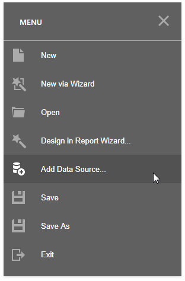
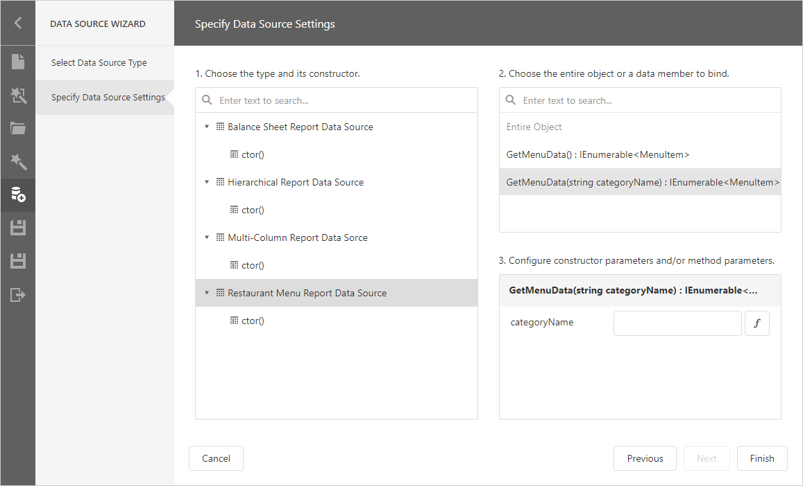
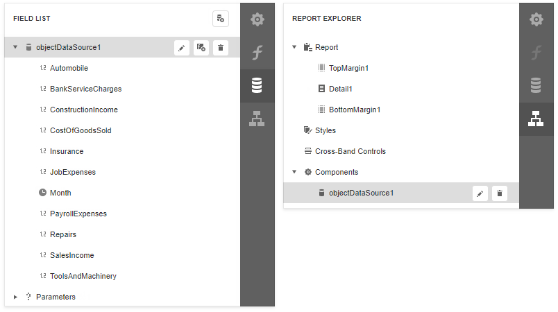

# Bind a Report to an Object Data Source

This topic describes how to bind a report to object data at design time.

## Add a New Data Source

1. Select **Add Data Source** from the [designer menu](../report-designer-tools/menu.md).
	
    

    This invokes the [Data Source Wizard](../report-designer-tools/data-source-wizard.md).

2. Choose **Object** and click **Next**.
	
    

3. Specify data source settings on the next screen.

    

    * Select an object type or constructor from the list. If you select an object type, the default constructor is invoked.

        

    * Select the method that should provide data. Alternatively, select **Entire Object** to bind the report to the object's fields.

        

    * Specify input values for a constructor and data member that requires input values.

        

        You can use expressions to provide data source parameter values. Click a parameter's marker and select **Expression** from the popup menu to switch the parameter's editor to the expression mode. Specify an expression in the parameter's editor, or click the parameter's ellipsis button to launch the [Expression Editor](../report-designer-tools/expression-editor.md). You can use [report parameters](../shape-report-data/use-report-parameters.md) in expressions to specify an input value for a data source parameter.

        

Click **Finish** to close the Data Source Wizard.

After you finish the wizard, it creates an **ObjectDataSource** component and binds the report to this component. The component retrieves the data fields that the selected object or method exposes. The [Field List](../report-designer-tools/ui-panels/field-list.md) reflects the data source structure.

## Configure Parameters

Choose an **ObjectDataSource** component in the Field List and click **Edit Parameters**. Reconfigure the parameters on the invoked wizard page and click **Finish** to apply the changes.

For more information on how to set up an object data source, refer to the [Data Source Wizard](../report-designer-tools/data-source-wizard.md).