# Create a Report with Cross-Band Content and Populated Empty Space

This tutorial describes how to create an invoice report with the following layout options:

- Print part of the content across bands (the blue panel);
- Populate the empty space between the detail and footer information with blank rows.

## Initial Report

[Create](../add-new-reports.md) or [open](../open-reports.md) a [table report](../create-popular-reports/create-a-table-report.md) that has an empty space between the _Detail_ band and the footer, like the invoice report below.

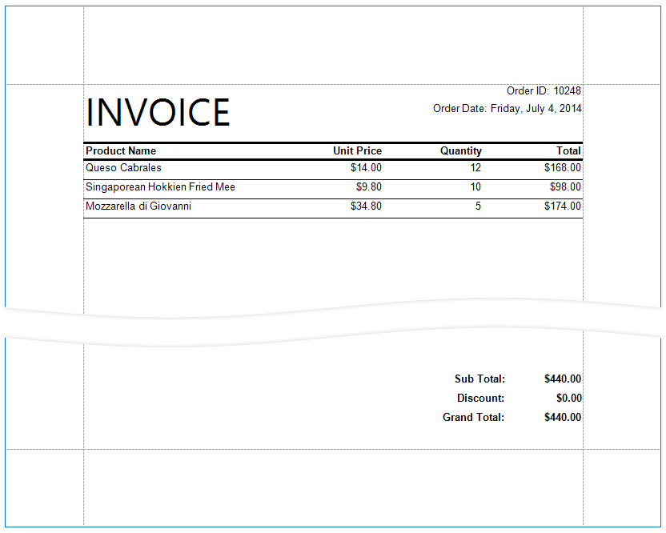

## Add Line Numbers

1. Select the first cell in the [Detail band](../introduction-to-banded-reports.md)'s table and click **Insert Column to the Left** in the Actions panel.

	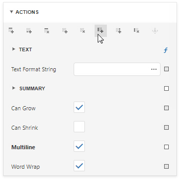

1. Select the new cell and set **Summary**/**Running** to _Group_.

	

1. Switch to the **Expressions** tab and click the **Text** property's ellipsis button. Specify the _sumRecordNumber()_ expression in the invoked Expression Editor.

	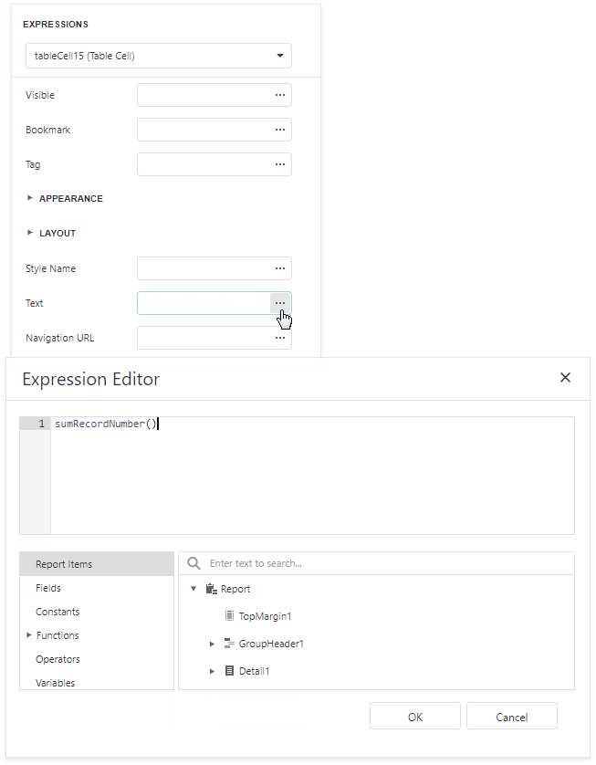

	Each row now includes a number.

## Populate the Empty Space

Add empty lines to invoices to populate the empty space between the _Detail_ band's data and the totals.

Select the _Detail_ band and enable the **Fill Empty Space** property.

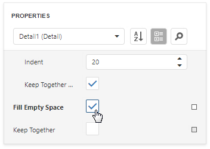

Invoices now include numbered lines that continue until the totals.

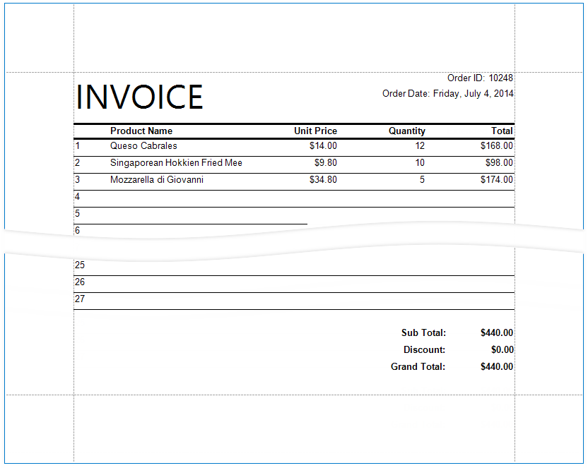

> [!NOTE]
> Set the **Text** properties of the _Detail_ band's controls to display static text within the added lines.

## Add Cross-Band Data

Add a panel with recipient details across the entire group. Place the panel on a separate _Group Header_ band that is printed on the background of other bands.

1. Select the report and click **Insert Group Header Band** in the Actions group.

	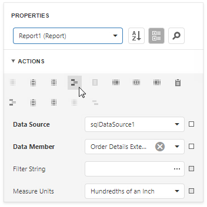

1. Select the added band and enable the **Print Across Bands** property. This makes the band content start on the background of the group's other bands.

	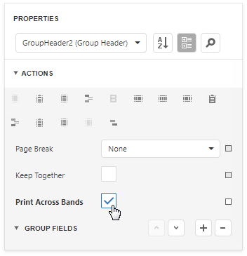

	> [!Tip]
	> Choose a _Page Header_ band instead of the _Group Header_ to display the cross-band content on an entire page.

1. As the new _Group Header_ band is above the header, it is not included in the grouping. Move the group fields from the previous _Group Header_ band to the new band.

	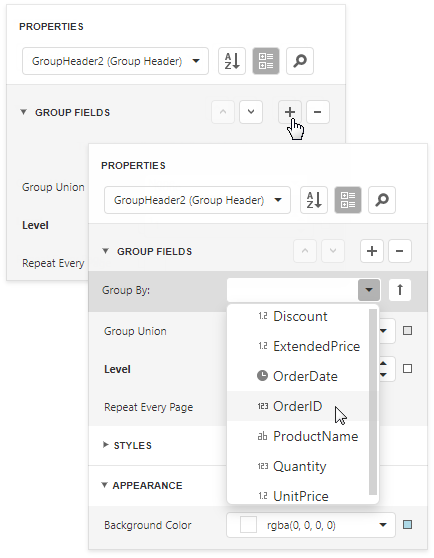

1. Add a [Panel](../use-report-elements/use-basic-report-controls/panel.md) control to the _Group Header_. Specify the panel's **Background Color** and drop fields onto the panel.

	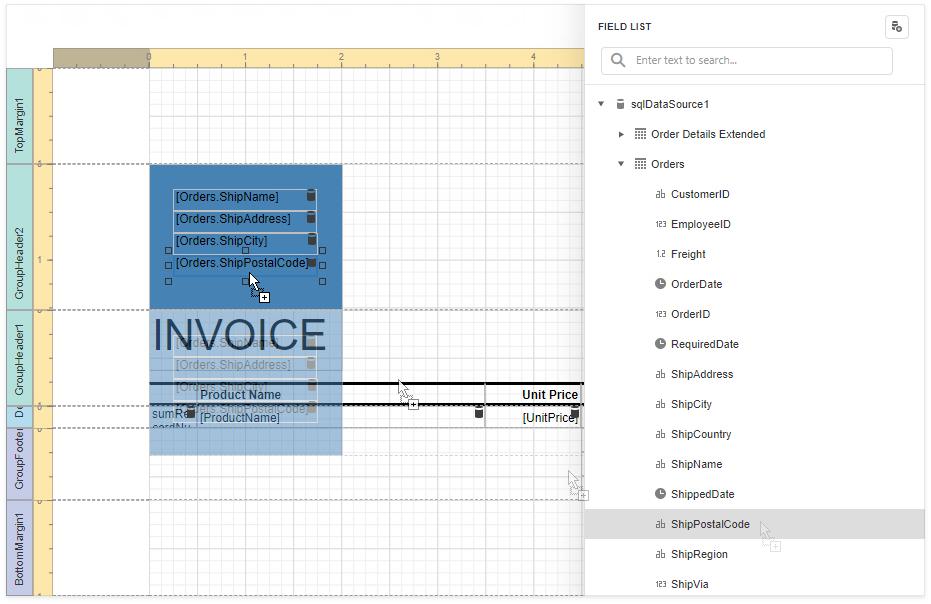

1. Adjust the panel's width and height. The height should match the page height, as the footer is printed at the bottom of the page (the _Group Footer_'s **Print At Bottom** property is enabled).

	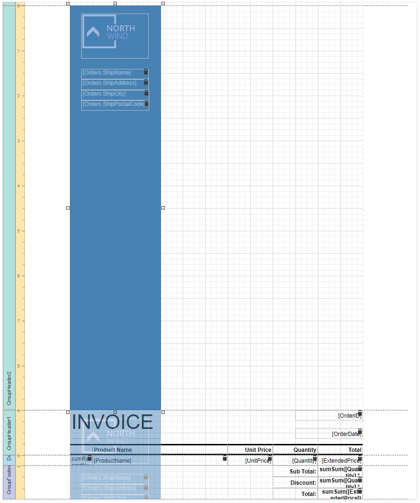

1. Switch to Print Preview. The panel is printed on the background of the group content.

	

1. Resize the content in other bands to print it side-by-side with the panel.

	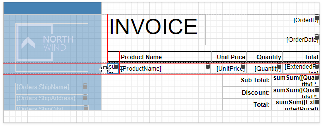

See the final report in Print Preview.

