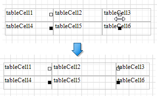
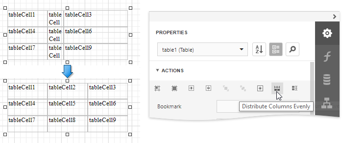
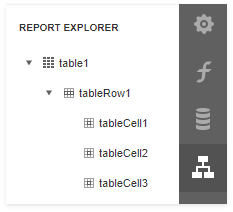
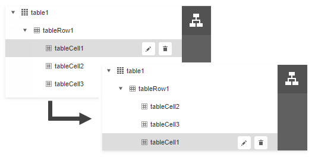
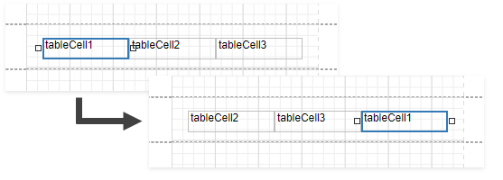
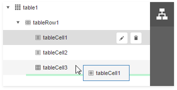
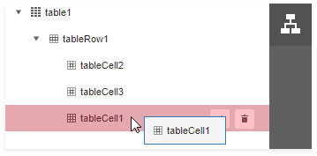

# Manipulate Table Elements

## Select Table Elements
You can click a table cell to select it and [access its settings](../manipulate-report-elements/select-report-elements-and-access-their-settings.md). To select multiple cells, hold the CTRL key and click cells.

Use the arrow that appears when a mouse cursor hovers over the table edges to select an entire row or column.

Draw a rectangle around the table to select the whole control.

The [Properties](../../../report-designer/report-designer-tools/ui-panels/properties-panel.md) panel enables you to select the table element or the entire table and access their properties.

## Resize Table Elements
You can resize a table or its cell by dragging the rectangle drawn on its edge or corner. 

Resizing a column changes the next column's width without affecting the other columns (keeps the table dimensions intact).
	

Resizing a row changes the next row's width without affecting the other rows (keeps the table dimensions intact).
	

You can set the same size for multiple table columns or rows. Select the required rows or the whole table, right-click the selected area and choose **Distribute Rows Evenly**.

If the cell's content is partially visible in the resulting row, this row automatically increases its height to fit its content and also adjusts the other rows accordingly.

You can resize columns equally in a similar way by selecting the columns or the table itself and choosing **Distribute Columns Evenly** in the context menu.

## Reorder Table Cells

You can change table cells' order in the [Report Explorer](../../report-designer-tools/ui-panels/report-explorer.md). To do this, select a cell and drag it to a new position.

 During the drag-and-drop operation, the dragged and focused cells are swapped. 

   

   
 
 - The green light indicates where the cell can be dropped. 

      
 
 - The red light indicates where the cell can't be dropped.

     

## Stretch Table Cells
You can stretch a cell so that it occupies several rows and columns. To stretch a cell across several columns, remove a neighboring cell by pressing DELETE or selecting the **Delete Cell** command in the **Action** category.

Use a table cell's **Row Span** property to specify the number of rows the table cell spans.

